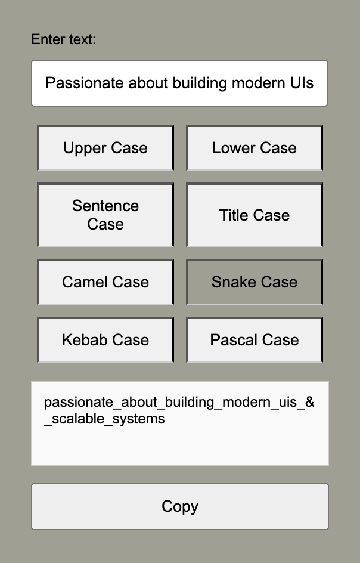

# 🚀 TextTransformer

**TextTransformer** is your go-to Chrome extension for quickly converting text into various case styles — perfect for developers, writers, or anyone who deals with text formatting.

---

## ✨ Features

✔️ Instantly convert text to:

- 🟦 **UPPER CASE**  
- 🟨 **lower case**  
- 🟩 **Sentence case**  
- 🟧 **camelCase**  
- 🟥 **snake_case**  
- 🟪 **kebab-case**  
- 🟫 **PascalCase**  
- 🟨 **Title Case**

🔄 Real-time conversion display  
🧭 Tab-based navigation for each case style  
👨‍💻 Simple, clean user interface

---

## 📸 Screenshots



---

## 🧩 Installation

To install the **TextTransformer** Chrome extension manually:

1. **Clone the repository:**

   ```bash
   git clone https://github.com/your-username/TextTransformer.git
   ```

2. **Navigate to the project directory:**

   ```bash
   cd TextTransformer
   ```

3. **Load into Chrome:**

   - Open Chrome and go to `chrome://extensions/`
   - Enable **Developer Mode** (top right toggle)
   - Click **"Load unpacked"**
   - Select the `TextTransformer` project directory

---

## ⚙️ How to Use

1. Click the **TextTransformer icon** in your Chrome toolbar.
2. Enter your text in the input field.
3. Choose the desired case style using the tabs.
4. Your text is transformed in real-time and displayed below.

---

## 💡 Development & Contributions

Want to improve or extend the project? Contributions are welcome!

1. **Fork** this repo
2. **Clone** your fork:

   ```bash
   git clone https://github.com/ArshdeepGrover/TextTransformer-Chrome.git
   ```

3. **Create a feature branch:**

   ```bash
   git checkout -b feature/your-feature-name
   ```

4. Make your changes ✅  
5. Commit and push:

   ```bash
   git commit -m "Add: your feature"
   git push origin feature/your-feature-name
   ```

6. **Open a Pull Request** – we'll review it soon!

---

## 📬 Contact

Feel free to reach out or connect if you have questions or ideas!

- ✉️ Email: [arsh199820@gmail.com](mailto:arsh199820@gmail.com)
- 🐙 GitHub: [@ArshdeepGrover](https://github.com/ArshdeepGrover)
